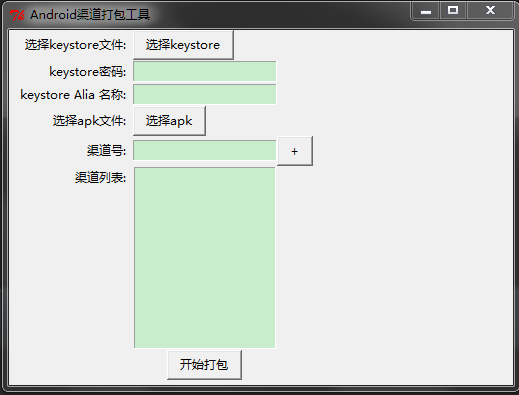

# Android多渠道打包工具
> 开发环境：windows7<br/>
> 工具：PyCharm4.5.4<br/>
> 语言：python2.7<br/>

## 生成exe可执行文件的方法：
1. 安装py2exe

2. 执行如下命令：
```python
    python setup.py py2exe
```

3. dist目录中的**window_pack_signed_apk.exe**即为工具启动器
> 需要在dist目录中创建temp目录<br/>
> 需要将apktool目录拷贝到dist目录中<br/>
> 需要将zipalign命令拷贝到dist目录中<br/>

## 工具截图

